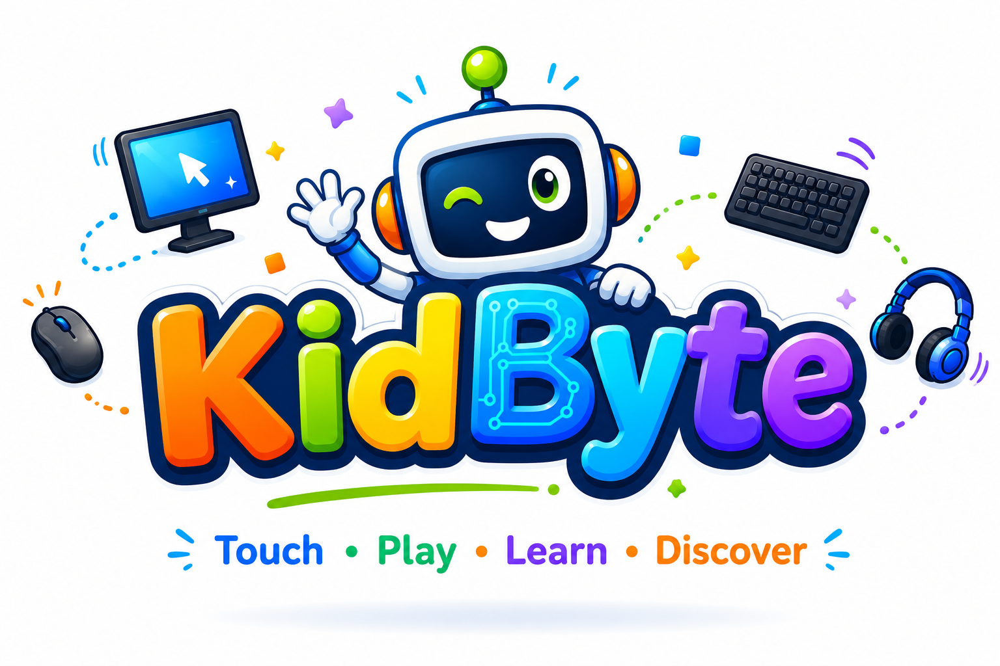

<div align="center">



# KidByte — Touch • Play • Learn • Discover

**An immersive, ad-free educational platform for children aged 5–14**  
explaining computers, hardware, binary, pixels, and more  
through fun analogies, interactive animations, and age-adaptive quizzes.

[](https://nextjs.org)
[](https://www.typescriptlang.org)
[](https://tailwindcss.com)
[](https://www.framer.com/motion)
[](LICENSE)

</div>

---

## ✨ What is KidByte?

KidByte explains technology the way a parent would — with real-world analogies a small child can immediately understand.

| Concept | KidByte Explains It As… |
|---|---|
| **Folder** | A room where similar things live. Knock twice (double-click) to open the door. |
| **Drag & Drop** | Like mom twisting your ear and pulling you to sit where she wants. |
| **CPU** | Your brain — it tells every part of the computer what to do. |
| **RAM** | Your study table — open books on it while you work; cleared when you leave. |
| **GPU** | An artist who paints every pixel on screen at lightning speed. |
| **Binary** | A secret language of light switches — ON (1) and OFF (0). |
| **Pixel** | A tiny coloured tile. Millions of them together make a picture. |

---

## 🎯 Product Principles

| | |
|---|---|
| ✅ **Zero Ads** | No advertisements. Ever. |
| ✅ **Zero Tracking** | No analytics, no tracking pixels, no third-party scripts. |
| ✅ **Zero Data Collection** | We don't know who you are. |
| ✅ **Zero Cookies** | Not a single cookie set. |
| ✅ **Session Only** | All data lives in `sessionStorage` — wiped when the browser closes. |
| ✅ **No Backend** | Fully static. No server, no database, no API keys. |
| ✅ **Always Free** | Learning stays free. A donation page exists for those who want to support. |

---

## 🗺️ Features

### 📚 Lesson System
- **7 topic categories**: Devices, Components, Digital World, Machine Language, Graphics, Storage, Programming
- **20+ lessons** planned; **5 fully live**: Folder, CPU, RAM, Binary, Pixels
- Each lesson has three tabs: **Story** → **Explore (interactive demo)** → **Quiz**
- Content adapts to **three age groups**: 5–7 · 8–10 · 11–14

### 🎮 Interactive Animations (Framer Motion)
| Lesson | Animation |
|---|---|
| Folder | Knock-knock door — double-click to open |
| CPU | Brain signals radiating to all peripherals in real time |
| RAM | Study table — open/close apps and watch RAM fill up |
| Binary | Live name-to-binary converter with light-switch visualiser |
| Pixels | Resolution slider: 4×4 → 32×32 heart — watch pixels sharpen |

### 🧩 Age-Adaptive Quiz Engine
- Questions automatically matched to the child's age group
- Immediate explanation after every answer
- Score tracked in session; shown on the badge

### 🏅 Digital Signature / Badge
- Child's name converted to **binary** (letter by letter)
- Age shown in **binary** and **hexadecimal**
- Emoji binary cheatsheet (15 popular emojis with Unicode + binary)
- **One-click PDF download** — generated 100% client-side (jsPDF + html2canvas)
- Privacy note printed on the badge: *"Generated locally. Never stored anywhere."*

### 👨‍👩‍👧 Parent Zone
- Full privacy explanation
- Age-group breakdown
- Safe-by-design summary

---

## 🏗️ Tech Stack

```
Next.js 16 (App Router)   Static-site generation, file-based routing
TypeScript 5              Full type safety across lessons, session, quiz
Tailwind CSS 4            Utility-first styling, custom animations
Framer Motion 12          All lesson animations and page transitions
jsPDF + html2canvas       Client-side PDF badge generation
sessionStorage            Only data store — no backend, no cookies
Vercel                    Recommended deployment (free tier)
```

---

## 📁 Project Structure

```
kidbyte/
├── app/
│   ├── page.tsx                  # Homepage: hero + onboarding + category grid
│   ├── explore/
│   │   ├── page.tsx              # Lesson hub with category filter
│   │   └── [slug]/page.tsx       # Individual lesson route
│   ├── quiz/page.tsx             # Quiz hub
│   ├── signature/page.tsx        # Digital badge + PDF download
│   ├── donate/page.tsx           # UPI QR donation page
│   └── parent-zone/page.tsx      # Privacy & parent info
│
├── components/
│   ├── Header/Header.tsx         # Sticky header with animated logo
│   ├── Footer/Footer.tsx         # Footer with donation banner
│   ├── Onboarding/Onboarding.tsx # 3-step name → age → avatar flow
│   ├── Lesson/LessonPage.tsx     # Story / Explore / Quiz tab layout
│   ├── Quiz/QuizComponent.tsx    # Age-adaptive quiz engine
│   └── animations/
│       ├── FolderAnimation.tsx   # Knock-knock door
│       ├── CpuAnimation.tsx      # Brain signal rays
│       ├── RamAnimation.tsx      # Study table fill
│       ├── BinaryAnimation.tsx   # Live binary converter
│       └── PixelAnimation.tsx    # Resolution heart demo
│
├── content/lessons/              # All lesson data (TypeScript)
│   ├── folder.ts
│   ├── cpu.ts
│   ├── ram.ts
│   ├── binary.ts
│   ├── pixels.ts
│   └── index.ts
│
├── hooks/useSession.ts           # sessionStorage CRUD hook
├── lib/
│   ├── types.ts                  # Lesson, Session, Quiz types
│   ├── constants.ts              # Brand colours, categories, avatars
│   └── utils.ts                  # Binary/hex converters, emoji cheatsheet
│
└── public/
    └── KidByte_Logo.png          # Official logo
```

---

## 🚀 Getting Started

```bash
# Clone
git clone https://github.com/YOUR_USERNAME/kidbyte.git
cd kidbyte

# Install
npm install

# Dev server
npm run dev
# → http://localhost:3000

# Production build
npm run build
npm start
```

---

## ➕ Adding a New Lesson

**1. Create the lesson file:**

```typescript
// content/lessons/gpu.ts
import { Lesson } from "@/lib/types";

const lesson: Lesson = {
  id: "gpu",
  title: "What is a GPU?",
  emoji: "🎨",
  category: "components",
  story: {
    "5-7":  "The GPU is like a super-fast painter...",
    "8-10": "GPU stands for Graphics Processing Unit...",
    "11-14": "A GPU contains thousands of small cores...",
  },
  analogy: {
    "5-7":  "A painter who colours every tiny dot on screen.",
    "8-10": "Thousands of mini-workers painting pixels in parallel.",
    "11-14": "Massively parallel SIMD architecture for matrix operations.",
  },
  quiz: [
    { for: "5-7", question: "GPU is like a...", choices: ["Painter", "Driver", "Cook"], correct: 0 },
  ],
};
export default lesson;
```

**2. Register it:**

```typescript
// content/lessons/index.ts
import gpu from "./gpu";
const lessons = { ..., gpu };
export default lessons;
```

**3. Optionally add an animation:**

```typescript
// components/animations/GpuAnimation.tsx  ← build with Framer Motion

// components/Lesson/LessonPage.tsx
import GpuAnimation from "@/components/animations/GpuAnimation";
const ANIMATION_MAP = { ..., gpu: GpuAnimation };
```

---

## 🔮 Roadmap

### MVP (Current — v1.0)
- [x] Onboarding flow (name → age → avatar)
- [x] 5 lessons: Folder, CPU, RAM, Binary, Pixels
- [x] 5 interactive Framer Motion animations
- [x] Age-adaptive quiz engine (3 groups)
- [x] Digital badge with client-side PDF download
- [x] Donate page with UPI QR
- [x] Parent Zone with privacy details

### Phase 2
- [ ] GPU, SSD, Motherboard, OS, Software, Drag-Drop lessons
- [ ] RGB colour mixer interactive demo
- [ ] PWA manifest for offline support
- [ ] Voice narration (Web Speech API)
- [ ] Accessibility audit (WCAG 2.1 AA)

### Phase 3
- [ ] Programming lessons (Python intro, Scratch intro)
- [ ] Networking & Internet explained
- [ ] AI & Machine Learning intro for kids
- [ ] Mobile app (React Native / Capacitor)
- [ ] Multilingual: Hindi, Tamil, Telugu

---

## 💖 Supporting KidByte

KidByte is free. Always. If it helped your child learn something today:

🇮🇳 **India:** UPI — scan the QR on the Donate page  
🌍 **International:** Coming soon (Stripe / PayPal)

---

## 📄 License

MIT © KidByte — free to use, fork, and build upon.

---

<div align="center">
Made with ❤️ for curious kids everywhere.<br/>
<strong>Touch • Play • Learn • Discover</strong>
</div>
